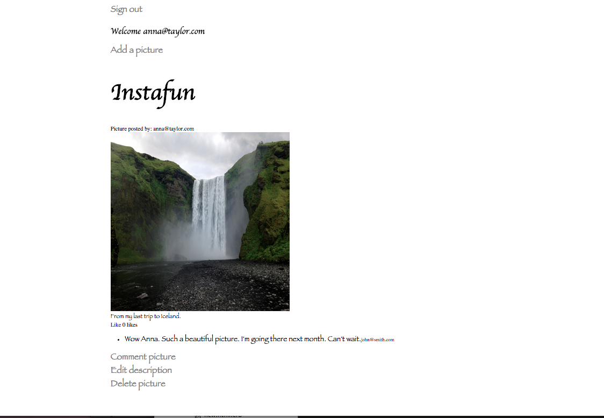

[](https://codeclimate.com/repos/55b38e3a6956800b44014e12/feed)   [](https://travis-ci.org/AnnaKL/instagram-challenge)

Instagram Challenge
===================

 

Challenge
-------
An Instafun (inspired by Instagram) that allows user to post, comment and like pictures.


Implemented functionalities
-----

* User can sign up, sign in, sign in with Facebook and sign out
* User can add a picture
* User can comment on picture
* User can like a picture
* User can only edit or delete pictures he/she created.


Technologies
-----

* Ruby on Rails
* Active Records
* Devise gem
* Omniauth-facebook gem
* Paperclip gem
* RSpec and Capybara (used for testing)
* HTML
* CSS

How to run
-----

```
git clone git@github.com:AnnaKL/chitter-challenge.git
cd chitter-challenge
bundle install
rails s
type http://localhost:3000/ in the browser
```
* To run the test type rspec in the application directory

To do
-----
* Improve styling.